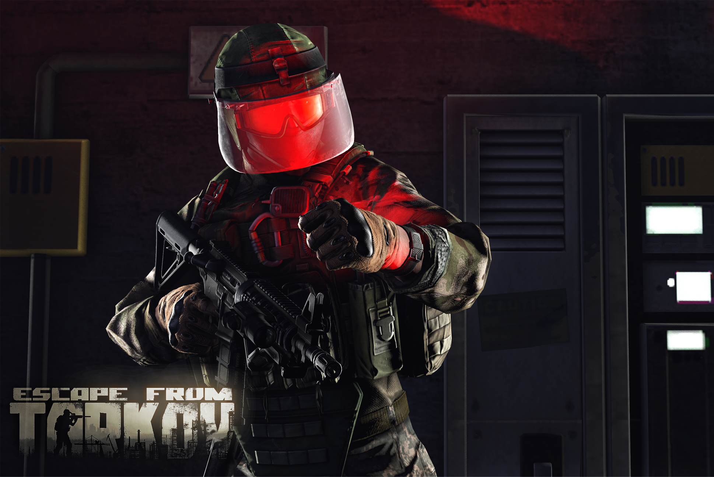
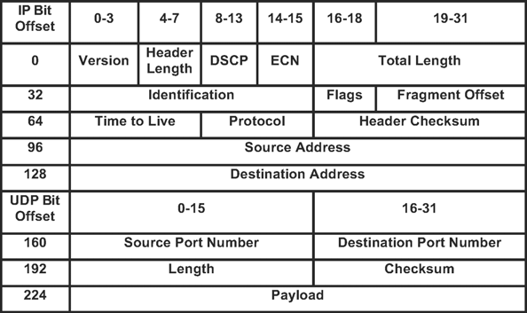

<p align="center">
    
</p>
<p align="center">
    <b style="font-size:40px">Tarkov Wireless Vulnerability</b><br>
    <a>Escape from Tarkov wireless vulnerability PoC</a>
</p>

-----

<p align="center">
   <a href="https://www.python.org/downloads/">
      
   </a>
   <a href="https://www.python.org/downloads/">
      
   </a>
   <a href="https://en.wikipedia.org/wiki/MIT_License">
      
   </a>
   <a href="https://www.tensorflow.org/">
      
   </a>
   <a href="https://reactjs.org">
      
   </a>
   <a href="https://houndci.com">
      
   </a>

## Technologies

* ARP Cache Poisoning & MITM
* Tensorflow 2 
* Flask
* React.js & Three.js

## Prerequisites

* Windows machine running Tarkov
* A secondary device running Linux (on the same local network)


## Disclosure


**This project should NOT be used for anything other than as an educational resource. Important elements are intentionally ~~redacted~~ to prevent misuse.**

**This information has been sent to Battlestate Games as a "Reproducable game exploit method allowing players to kill/loot while invisible, see players through walls, loot map of all valuable items in seconds."**

**Mitigation solutions are posted at the bottom of this readme**

## A video Demo


[](https://www.youtube.com/embed/pONO_bHGHVI "Demo")

# Getting started

1) Clone Repo
2) Set up secondary linux machine
3) Set up networking rules
4) Learn the structure of the game packets
5) filter out by udp and obtain player info
6) make player info available via flask api
5) launch react web service for esp
8) launch invisibility hack

https://askubuntu.com/questions/1033772/cant-get-my-netgear-a6210-usb-wifi-adapter-to-work-on-my-linux-ubuntu

### 1) Clone this repository

``` shell
git clone git@github.com:wau/norussian.git
```

### 2) Set up your Linux machine

If running in a virtualbox vm make sure you have a wireless adaptor plugged into the device for it to use


```shell
sudo apt-get install apt-get update && \
                     apt-get -qq -y install \
                     python3 \
                     python3-pip \
                     python \
                     python-pip \
                     iptables \
                     build-essential \
                     libnetfilter-queue-dev \
                     wireless-tools && apt-get clean
```


### 3) Set up your wireless packet interceptor


Discover your target's local ip address

Discover your attacker's primary wireless interface name


### 4) Set up networking rules

For outbound traffic filtering: 

```shell
sudo iptables -t raw \
              -A PREROUTING \
              -p udp --destination-port 17000:17100 \
              -j NFQUEUE --queue-num 1
```

For inbound traffic filtering:

```shell
sudo iptables -t raw \
              -A PREROUTING \
              -p udp --destination-port 56000:61000 \
              -j NFQUEUE --queue-num 2
```

List your ip tables rules to verify it has been added

```shell
sudo iptables -L --line-numbers
```


### 5) Learn the structure of the game packets

<p align="center">
    
</p>

> 0003c2f020292180 ffffffffffffffffffffffffffffff  f8 611dc65c271600aa001400794001021080068b4c57ff00e800622e00000000

Player rotation packets are 102 in length

> 

```python

movement_packets = [102, 110, 156, 172, 220] #or > 220  #TRY 

combat_packets = [142, 150, 158, 166] #combat (142, hatchet) (150, 158, 166 bullet/gun movement) 

loot_packets = [296, 302, 206, 344, 336] #loot (246, 166, 174 drop item) (296, 302 take item) (328, attach to gun) (206, search) (344, 336 switch into inventory)

```

Use tensorflow to automate finding what payload position corresponds to what action and generate new ones.


```shell
0005e029dfa7fc18fffffffffffffffffffffffffffffff00d85417740e6    1200aa00100060a0010210800e981d00000100000000    1200aa0010006000020210800e991d00000100000000    1200aa00100060800102108006991d00000100000000....      1200aa001000606001021080069d1d00000100000000    1200aa0010006080010210800e9e1d00000100000000    1200aa0010006080010210800e9f1d00000100000000    1200aa001000608001021080069f1d00000100000000    1200aa0010006080010210800ea01d00000100000000    1200aa0010006060010210800ea11d00000100000000    1200aa00100060a0010210800ea21d00000100000000     : 2798
```


### 7) MITM Attack on local network

```shell
sudo python3 mitm.py --interface en0 --ip [TARGET_IP]
```


### 5) [*Bannable*] Run your server

```shell
python app.py -- args
```

### 8) [*Bannable*] Launch your visual ESP HUD

You will be able to see the location of each player relative to your position


### 9) [*Bannable*] Go invisible in game

Your player will freeze in place for other people but you will be able to move around, kill and loot without them seeing.

```shell
sudo python3 nfqueue.py
```

# Solutions

The following is a list of possible preventative solutions with reducing effort

## Encryption of services

Encrypt traffic to and from the client. This would prevent attackers from discovering patterns in the netcode without finding a way to decrypt.

## Netcode Updates

Rotational changes to the netcode to prevent people from discovering the payload structure of the UDP packets.

## Re-work of Netcode

Put less trust in the player's client and offload more work to the server.

## Donate

https://www.stjude.org/donate/donate-to-st-jude.html?sc_icid=wtg-lz-donatenow 


